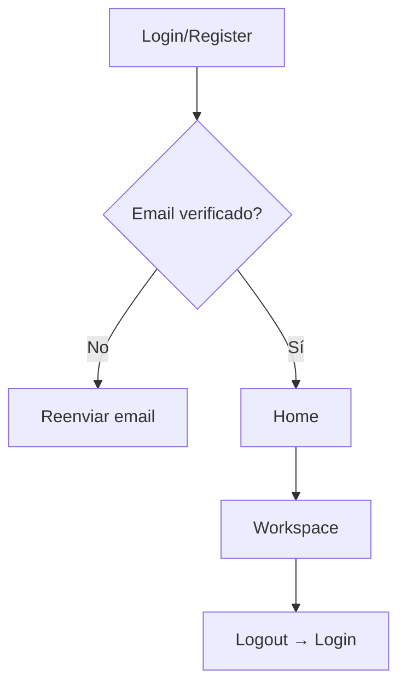
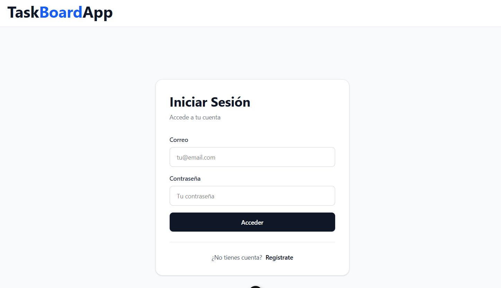
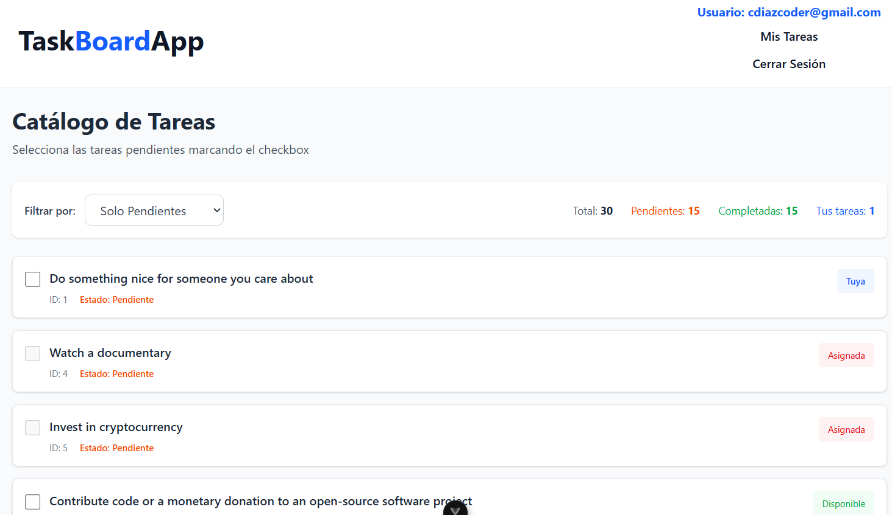
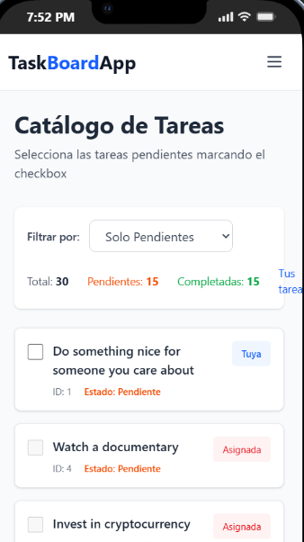

# TaskBoardApp 🚀

**Gestor de tareas colaborativo** con autenticación, asignación de tareas y filtros. App full-stack moderna construida para portfolio de Formación Profesional DWEC/DWES.

## ✨ **Características principales**

- 🔐 **Autenticación completa** con Firebase Auth + verificación de email
- 📱 **Diseño 100% responsive** (móvil, tablet, desktop)
- 🎨 **UI moderna** con TailwindCSS y animaciones suaves
- 📊 **Gestión de tareas** con estados visuales dinámicos
- 👥 **Sistema de asignación** (Mis tareas / Tareas de otros / Disponibles)
- ⚡ **Estado reactivo** con Pinia stores
- 🚀 **Rutas protegidas** (Home y Workspace solo para usuarios verificados)

## 🛠 **Tecnologías**

| Frontend | Backend | Estado | Estilos | Utils |
|----------|---------|--------|---------|-------|
| Vue 3 + Composition API | Firebase Firestore | Pinia | TailwindCSS | Vue Router |
| Vue Toastification | Firebase Auth | Firebase Realtime | Headless UI | Vite |

## 📱 **Funcionalidades por pantalla**

### **Login/Register**
```
- Registro con email/password
- Login con email/password  
- Verificación de email obligatoria
- Mensajes de error con toast
- Redirección automática post-verificación
```

### **Home (Todas las tareas)**
```
- Lista completa de tareas (DummyJSON API)
- Filtros: Pendientes / Completadas
- Tarjetas responsive con hover effects
- Checkbox dinámico por estado:
  • ✅ Completada: Gris opacity-50
  • ❌ Otro usuario: Rojo opacity-50  
  • 👤 Mi usuario: Azul interactivo
  • 🟢 Disponible: Verde interactivo
```

### **Workspace (Mis tareas)**
```
- Solo tareas asignadas al usuario actual
- CRUD básico (marcar completadas)
- Store persistente en Firestore
- Actualización en tiempo real
```

## 🎨 **Estados visuales del Checkbox**

| Estado | Color | Interactivo | Clases Tailwind |
|--------|-------|-------------|-----------------|
| Completada | `accent-gray-400` | ❌ | `opacity-50` |
| Asignada a otro | `accent-red-400` | ❌ | `opacity-50` |
| Asignada a mí | `accent-blue-600` | ✅ | - |
| Disponible | `accent-green-600` | ✅ | - |

## 🚀 **Instalación rápida**

```bash
# Clonar repositorio
https://github.com/cdiazcod17/TaskBoardApp.git
cd taskboardapp

# Instalar dependencias
npm install

# Configurar Firebase (crea firebase/config.js)
npm run dev
```

### **Variables de entorno**
```

VITE_FIREBASE_API_KEY=xxx
VITE_FIREBASE_AUTH_DOMAIN=xxx
VITE_FIREBASE_PROJECT_ID=xxx
```

## 📂 **Estructura del proyecto**

```
src/
├── components/
│   ├── HeaderNavbar.vue
│   ├── TaskCard.vue
│   └── LoginForm.vue
├── stores/
│   ├── tasks.js (API + filtros)
│   └── userTasks.js (Firestore)
├── views/
│   ├── Home.vue
│   ├── Workspace.vue
│   └── Login.vue
├── firebase/
│   └── config.js
└── router/
    └── index.js (guard protegido)
```

## 🔐 **Flujo de autenticación**



## 📊 **Stores principales**

### **Tasks API Store**
```javascript
// Carga tareas desde DummyJSON
const getTasks = async () => {
  apiTasks.value = response.data.todos
}
```

### **User Tasks Store** 
```javascript
// Persiste en Firestore: usuarios/uid/tareas: ["task1", "task5"]
const addTask = async (taskId) => {
  await updateDoc(docRef, { tareas: arrayUnion(taskId) })
}
```

## 🎯 **Para desarrolladores**

- **Customizar colores**: `tailwind.config.js`
- **Añadir tareas reales**: Migrar de DummyJSON a Firestore
- **Deploy**: Vercel/Netlify (Vite listo)
- **Testing**: Vitest + @vue/testing-library

## 📸 **Capturas**

<!-- Mobile -->

<!-- Mobile -->

<!-- Mobile -->



## 👨‍💻 **Autor**

**Carlos Diaz** - Estudiante FP Desarrollo Web  
[LinkedIn]www.linkedin.com/in/carlosdiaz0517 | [GitHub](https://github.com/cdiazcod17)  
*Proyecto para prácticas DWEC/DWES 2026*

## 📄 **Licencia**

MIT - ¡Siéntete libre de usarlo/forkearlo!

***


**¡Gracias por revisar mi proyecto! 🚀** task-board-njzgh5wkf-cdiazcod17s-projects.vercel.app